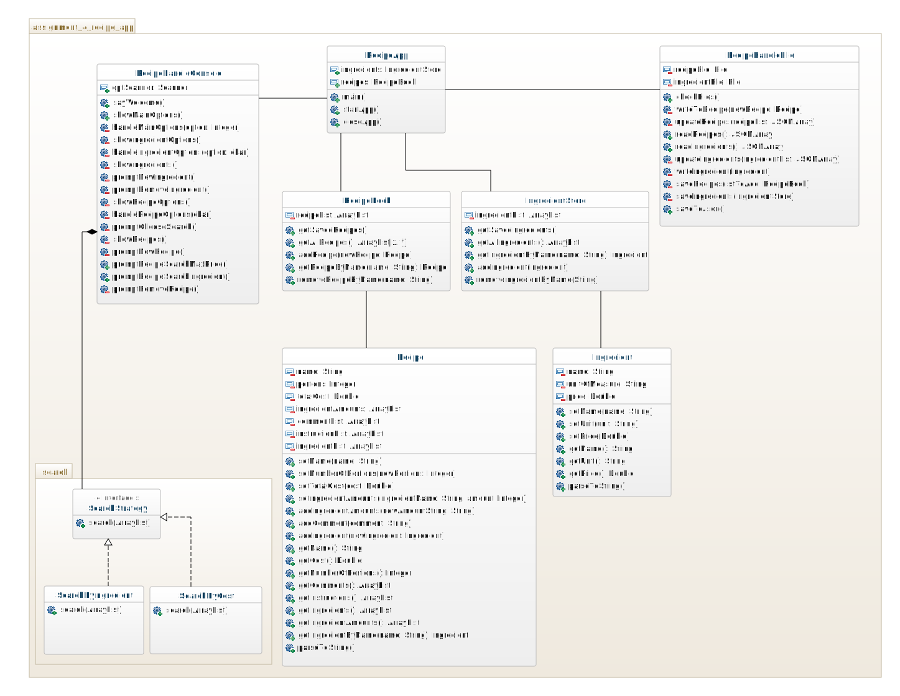

## Recipe Application - Assignment 4

When you run the application the application prompts you to make a decision which all are explained.

In search methods you might get redirected to another menu and this means that the search did not give any result.

Of the passing grade requirement the following are implemented in full or in parts and those requirements are explained as well:
* 1
* 2 - The ingredient name is not unique though.
* 3
* 4
* 5 - Does not affect recipes.
* 6
* 7
* 8 - You can look for a recipe yes but not modify it.
* 9
* 10
* 11
* 12
* 13
* 15
* 16
* 17 - As far as my knowledge goes, most of the requirements here are done but not all.
* 18 - There are flaws.
* 19 - This file.

Not implemented at all:

* 14

### Reason for not finishing the assignment

Simply put, out of time and I hate not being on time and not managing deadlines so this is really the best I could do with the time given, especially in combination with the other course having it's final assignments as well.
I do believe that handing in a working, yet not perfect, application on time is better than missing a deadline.

### Extras

* The application looks (at the start) for json files in ./files directory and if they dont exist they will be created along with the directory.

### Updated class diagram

